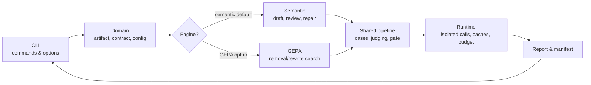

# Zen


<p><strong>Less input. Less output. More clarity.</strong></p>
<p>Zen is a dataset-free optimizer for GitHub Copilot customization artifacts (<code>AGENTS.md</code>, <code>SKILL.md</code>, prompt and instruction files). It rewrites one Markdown instruction body more compactly, saves a reviewable draft, and checks — with evidence, not a guess — whether meaning and behavior survived. No user-supplied labeled dataset is required.</p>

<br clear="left" />

## Why it matters

AI agents keep getting better at producing results. The bottleneck has moved:
**people now spend more time understanding a result than the agent spent producing it.**
Long instructions go in. Long explanations come out. The decision that actually
mattered gets buried under detail nobody asked for.

- **Less to read, for the same result.** Shorter instructions and shorter answers
  mean less human time spent re-checking that an agent did the right thing.
- **No dataset to build first.** Almost no team has a labeled "correct answer" set
  for its internal instruction files. Zen generates its own test cases from the
  artifact itself, so optimization can start on day one, on any file.
- **The premise is tested, not assumed.** Independent research already shows some
  system prompts shrink more than 80% with no measured loss, and that most of a
  skill's value comes from clear procedure, not added facts
  ([source](https://aicostcheck.com/blog/anthropic-context-engineering-claude-5-prompt-cut),
  [source](https://arxiv.org/abs/2608.14036)). Zen tests whether that holds for your
  own files instead of asserting it.
- **Verified, not just shortened.** A draft only counts as done when Zen finds no
  meaningful loss in behavior, checked on cases it never used to shape the draft.

## What Zen does

Zen optimizes **one Markdown instruction body** using tool-free Copilot sessions.

- **Rewrite the meaning, not just the lines.** The default semantic engine reads
  the whole body and consolidates repetition while preserving actions, constraints,
  conditions, exceptions, priorities, language, and required public output formats.
- **Save before judging.** A usable draft is written before evaluation. Later
  evaluation errors or budget exhaustion do not discard it.
- **Compare meaning.** Direct instruction review and small task-based comparisons
  look for important omissions, contradictions, and behavioral regressions, not
  identical wording or mandatory quotations.
- **Bound the work.** A small call budget and limited correction rounds replace
  open-ended deletion/search as the default.
- **Keep the source unchanged.** Metadata and source bytes are protected; generated
  drafts are separate files, never automatically applied.

Zen supports AGENTS.md, copilot-instructions.md, SKILL.md, and files ending in
`.instructions.md`, `.prompt.md`, or `.agent.md`. YAML frontmatter, UTF-8 BOM, and
line-ending convention are preserved.

## How it works

1. **Read** the original instructions in full; anything outside an explicitly
   selected scope stays untouched.
2. **Rewrite** into a shorter draft, saved immediately — before any evaluation risk.
3. **Review** the rewrite against the original for concrete meaning changes, with
   one bounded repair if something material is found.
4. **Test it**: generate cases straight from the artifact's own text, split into
   validation and holdout groups, and have the same model answer real requests with
   each version.
5. **Compare** original vs. candidate answers for facts, constraints, and completed
   tasks, not word-for-word similarity.
6. **Decide**: publish only if the draft is smaller, meaningfully unchanged, and the
   combined artifact-plus-answer size fell by at least 3%.

Two engines run this same contract. **Semantic** (default) is a fast, bounded single
rewrite with one repair pass — the safe everyday default. **GEPA** (opt-in) is a
broader search across many candidate rewrites, for when the extra model budget is
worth spending on a deeper result. Reach for GEPA when semantic's single rewrite
plateaus below the 3% bar, when the file is reused often enough that a larger
combined-reduction margin is worth a ~600- vs ~32-call budget, or when holdout
tokens must provably never grow rather than merely trend down.

```powershell
uv run zen optimize path/to/artifact.md                  # semantic, default
uv run zen optimize path/to/artifact.md --engine gepa    # GEPA, opt-in search
```

## Why dataset-free

There is no labeled "correct answer" dataset for an arbitrary instruction file, and a
hand-written reward function does not scale to every team's `SKILL.md`. Zen borrows
the core insight behind
[RULER (Relative Universal LLM-Elicited Rewards)](https://blog.dailydoseofds.com/p/how-to-fine-tune-llms-in-2026-bf8):
asking a model to score one output in isolation is unreliable, but asking it to
compare two outputs side by side is far more consistent, and needs no labels at all.
Zen applies that same relative judgment to compare an original answer against a
candidate answer, case by case, instead of scoring either one on its own. That is
also why there are two engines under one contract, not one fixed heuristic: Semantic
for a cheap, safe default; GEPA for a deeper search when the larger budget is worth
it. Both are judged the same dataset-free way, and neither escapes the same
validation-plus-holdout evidence bar described below.

## Architecture

Both engines share one evaluation contract instead of each reimplementing case
generation and judging:



- **CLI** parses commands and options and reports the final decision and exit code.
- **Domain** holds the shared vocabulary — artifact, configuration, behavior
  contract — that both engines read and write, so results stay comparable across
  engines.
- **Semantic** and **GEPA** are the only engine-specific code: one draft-first
  rewrite workflow, one search-based proposer. Neither reimplements evaluation.
- **Shared pipeline** generates source-grounded cases and runs the same behavior and
  task-level judging for whichever engine is selected.
- **Runtime** isolates every model call behind a budget and a content-addressed
  cache, so re-running the same request never silently costs more.
- **Report** renders the human-readable evidence and the machine-readable manifest
  that the CLI shows back to the user.

Three explicit model roles sit behind this, and any of them can be swapped:
**generator** creates cases, **target** produces the answers being compared, and
**strong** rewrites instructions and reviews meaning. Splitting the work this way
does not make their judgments independent of each other.

Nothing here modifies the source artifact; every path ends in a separate draft or
optimized copy plus a report, never an in-place rewrite.

## Install and verify

Requires Python 3.13 or later, uv, and a signed-in Copilot CLI account.

```powershell
uv sync
uv run python -m copilot download-runtime
uv run zen selfcheck
```

## Use

```powershell
uv run zen detect .\examples\in\debug.agent.md
uv run zen --budget 32 optimize .\examples\in\debug.agent.md --output-dir .\examples\out --quick
```

Global options such as `--budget` precede `optimize`. Default model roles are:

- Target: `gpt-5.6-terra` (`--target-model`).
- Strong: `gpt-5.6-sol` for rewriting and semantic judgments (`--strong-model`).
- Generator: `gpt-5.6-luna` for synthetic cases (`--generator-model`).

| Optimize option | Effect |
| --- | --- |
| `--engine semantic` | Whole-body semantic rewriting and bounded comparison; the default. |
| `--engine gepa` | Opt into GEPA search and its separate evaluation policy. |
| `--quick` | Smaller case set for an illustrative comparison. |
| `--output-dir DIRECTORY` | Write the draft and report in this directory. |
| `--aggressive 30%` | Request a body line cap. Semantic rewriting has no hard line cap by default. |
| `--no-aggressive` | Disable the body line cap. |
| `--focus task` or `--focus communication` | Edit only an explicitly marked section; outside text stays frozen. Default: `all`. |
| `--compare-concision` | GEPA-only diagnostic control; never a selected artifact. |

Focused edits require an exact `<!-- zen:task --> ... <!-- /zen:task -->` or
`<!-- zen:communication --> ... <!-- /zen:communication -->` pair. There is no
automatic semantic split.

The budget caps application model calls, not dollars or provider tokens. If the
remaining budget cannot complete the checks, the draft remains available with a
review-required status. See the [CLI and runtime guide](docs/documentation.md).

## Decisions and outputs

A shorter draft is not the result. Two separate questions both have to pass:

**Did the meaning survive?**

- **Instruction-level review** compares the original and rewritten text for concrete
  changes: a dropped obligation, a loosened condition or exception, a changed required
  format. Different wording, order, or length alone is not a failure.
- **Task-level comparison** asks the same model the same real questions using the
  original and the candidate instructions, then checks whether the answers still
  carry the same facts, constraints, and completed task, not whether the words match.
- Every comparison runs twice: once on cases used to shape the draft, and again on a
  separate holdout set the draft never saw. A result only counts if it holds up on
  both.

**Did it actually get smaller?**

- The rewritten artifact must be smaller than the source, not just reworded.
- The combined size of the artifact plus the median holdout answer must fall by at
  least 3%; answers may grow if the total still shrinks.
- The opt-in GEPA search adds one more bar: holdout token counts must never increase.

The semantic engine separates **having a draft** from **having sufficient verification**.
Harmless differences in wording, order, or length are not failures. Important missing
instructions, incorrect added requirements, or materially worse answers require review.
An original answer's existing defect is not automatically a candidate regression.

The report identifies instruction-level differences, validation and holdout results,
local token counts, errors, and output availability without filesystem paths.
Locations remain in the CLI and machine-readable manifest. Successful
verification is limited to these checks, not universal semantic equivalence.
Incomplete checks never become a successful score.

If complete evaluation flags a draft for review, a **final adjudication** compares
the frozen source, draft, cases, and both answers to distinguish new regressions
from shared baseline defects or evaluator mistakes. It may return **CONFIRMED**
after explaining every flagged finding and checking each phase separately. Original
findings remain in the report. This is model-reviewed confirmation, not independent
or human verification. Missing evidence, provider errors, changed source/draft bytes,
and unmet size/reduction requirements cannot be overridden.

| Semantic status | Meaning |
| --- | --- |
| VERIFIED | Initial complete checks passed without material candidate losses. |
| CONFIRMED | Final model review resolved the flags, or the user explicitly accepted the draft. The report identifies which. |
| REVIEW_REQUIRED | Unresolved differences, uncertainty, missing evidence, or unmet token gates; draft retained. |
| ERROR | No usable draft was generated. |

Both VERIFIED and CONFIRMED publish an optimized copy; neither changes the source.
For REVIEW_REQUIRED drafts, the interactive CLI asks whether to accept after showing
the draft and report paths. **Yes sets CONFIRMED (by user)** and updates the report
and manifest while preserving the earlier model decision, warnings and unmet gates.
No or Enter keeps the draft unconfirmed. Without an interactive terminal, no consent
is inferred; `--accept-draft` explicitly authorizes user confirmation for that run.
User acceptance does not turn failed checks into passes. Changed source or draft
files still block publication. GEPA does not support this override.
The final step uses one call, with at most one schema retry, inside the existing budget.
The same environment helps compare answers but does not establish independent samples.

Evaluation does not demand a "why this matters" paragraph for every simple answer.
However, an explicitly required public output format remains part of the instruction
contract; silently deleting it is not meaning-preserving compression.

Drafts remain available when verification cannot pass. If the first model call fails
to produce a usable rewrite, Zen cannot guarantee a draft; a failure report explains
what happened. Filesystem or invalid-input errors can prevent output creation.
GEPA's opt-in acceptance policy is documented separately in the runtime guide.

## What it costs to run

A hypothetical, not a promise: 1,000 employees, 40% using an agent daily, 3
instruction loads per user per day, 20 workdays a month — **24,000 monthly
instruction loads** on that one artifact. Every reuse of a shorter, verified draft
repays a little of the rewrite-and-evaluation cost it took to produce; at low reuse,
that cost may not be repaid at all. Input tokens, output tokens, retries, caching,
and model prices all set the real economics — Zen reports the token measurements,
not a currency savings figure.

## How Zen is different

- **vs. statistical prompt compressors** (e.g., LLMLingua/LLMLingua-2, Selective-
  Context — perplexity pruning, generic minifiers): those shorten text using
  properties of language in general, with no notion of what a *specific* instruction
  file is obligated to say. Zen grounds every test case in that file's own quotes,
  conditions, and constraints.
- **vs. search-based prompt optimizers** (e.g., DSPy's MIPRO, APE, OPRO,
  PromptBreeder): most need a labeled dataset or a hand-built reward function to
  score candidates. Zen needs neither — cases are generated from the source, and
  judgment is relative, not scored in isolation.
- **vs. codebase context tools** such as [Graft](https://github.com/trailhq/Graft),
  Sourcegraph Cody, Cursor's codebase indexing, and Aider's repo-map: these pre-build
  or pre-index *code* context — a graph, embeddings, or a symbol map — so an agent
  stops re-exploring the same repo every session. That is a runtime context problem,
  and Graft's strongest evidence (SWE-bench Verified) is real test execution: an
  actual pass or fail, no model judging required. Zen solves a different problem:
  compressing and verifying the *instruction file itself*, once. Instruction-
  following has no equivalent executable test suite, so Zen depends on relative
  model judgment instead of a deterministic pass/fail. Zen shares this category's
  caching and non-destructive-write habits, not its mechanism, and that gap in
  ground truth is why Zen's claims stay bounded to "no observed material loss,"
  never "proven correct."

**Less instruction in. Less unnecessary output. Faster understanding.**

> Do not create more output. Create output people can understand faster.

## Current limits

- No real-world performance guarantee: passing model checks does not guarantee task
  success or human comprehension in production.
- No tool execution, multi-turn workflow, or executable multi-file package evaluation.
- Semantic judgments are model-based proxies, not proof of equivalence or measured human comprehension.
- Token counts are local estimates, not billing or guaranteed future savings.
- Fresh application calls do not establish independent provider samples.
- Generated requirements and cases can miss behavior; acceptance is scoped to observed evidence.

See the [current limitations register](UNCONFIRMED_ASSUMPTIONS.md),
[example inputs](examples/README.md), and [full documentation](docs/documentation.md).

## Development

```powershell
uv run pytest -q
uv run zen selfcheck
uv run ruff check zen tests
```

Tests cover semantic workflow mechanics and opt-in GEPA integration with scripted
models, not universal quality, live provider reliability, or human-comprehension gains.